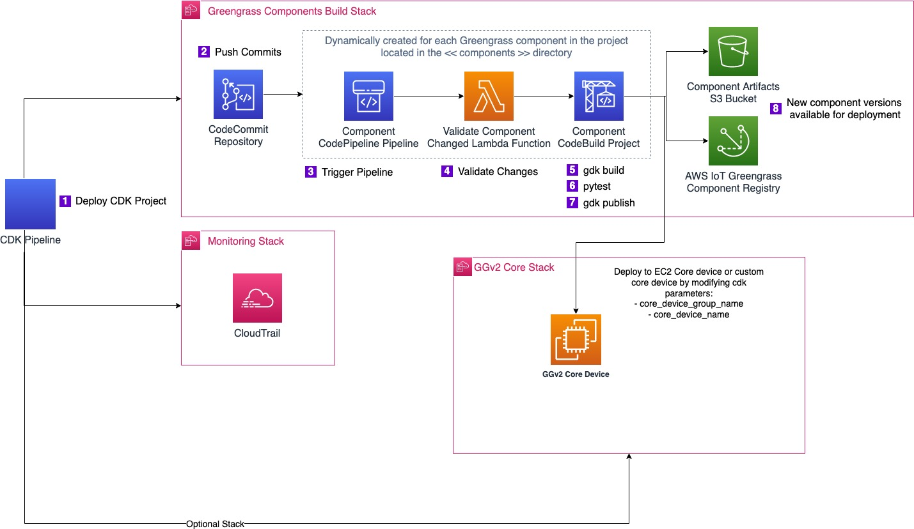

# Trigger AWS IoT Greengrass component deployments from AWS CodeCommit
This code repository is part of the blogpost [Link](https://aws.amazon.com/blogs/iot/trigger-aws-iot-greengrass-component-deployments-from-aws-codecommit/)

## Architecture


# Deployment instructions

## Requirements

* AWS CDK >= v2.22.0 (run `sudo npm install -g aws-cdk`)
> NOTE: See [Getting started with the AWS CDK](https://docs.aws.amazon.com/cdk/latest/guide/getting_started.html) for more information

## Initialize repository

* Create Code Commit Project
    * Go to AWS CodeCommit Console
    * Click on `Create Repository`
    * Provide name for the repository. For example `ggv2-cdk-blog-test`
    * Click on `Create`
* Clone the CodeCommit repository on your local machine, for example if the CodeCommit repository is named  `ggv2-cdk-blog-test`:
```
git clone codecommit::us-east-2://ggv2-cdk-blog-test
cd ggv2-cdk-blog
```
* In order to deploy the cdk you will need to copy the cdk contents from this repository. 
* To easily copy the contents of this github project to your new project, copy export.zip to your CodeCommit project directory,and unzip
Sample command
```
unzip export.zip
```

## Source code updates

Please update following attributes in **cdk.json** file with appropriate values:
   * **account**
   * **codecommit_repository_arn**
   * **region**
   * **create_core_device** acceptable values are true/false
   * **default_branch_name** branch to track for the pipeline
   * **core_device_name**
   * **core_device_group_name**
   * **project_prefix**

## Deploy CDK pipeline
> NOTE: See [Continuous integration and delivery (CI/CD) using CDK Pipelines](https://docs.aws.amazon.com/cdk/latest/guide/cdk_pipeline.html) for more information

In order to set up the CDK pipeline in your account, you have to run the following commands once.

First, bootstrap your account/region for CDK - replace the appropriate variables (i.e. ACCOUNT-ID, REGION, ADMIN-PROFILE) before executing.
> NOTE: the argument --profile is optional
> NOTE: if you get an error stating you cannot import aws_cdk in app.py, you may meed to run this command: python3 -m pip install -r requirements.txt
```
export CDK_NEW_BOOTSTRAP=1 
npx cdk bootstrap --cloudformation-execution-policies arn:aws:iam::aws:policy/AdministratorAccess \
aws://ACCOUNT-ID/REGION 
```

For example, like this:

```
export CDK_NEW_BOOTSTRAP=1                                    
npx cdk bootstrap --cloudformation-execution-policies arn:aws:iam::aws:policy/AdministratorAccess \
aws://123456789/us-east-2
```

...then set up your virtualenv for Python: You may need to use python3 in replacement of python, depending on your local python configuration. 

```
python -m venv .venv
source .venv/bin/activate
python -m pip install -r requirements.txt
```

...finally, commit your repo and deploy the CDK app: You may need to git push origin master, instead of git push. 

```console
git add --all
git commit -m "initial commit"
git push
cdk deploy
```

To update `export.zip` in your own project, run the following:

```
git archive -o ./export.zip HEAD
```

## Adding new Greengrass components

To add new components to the project, create a new component directory in the `components` directory. Make sure your components include the following:
* `gdk-config.json` (GDK configuration file)
* `buildspec.yml` (for CodeBuild)
* `requirements.txt` (for Python dependencies; currently used by provided buildspec.yml examples)
